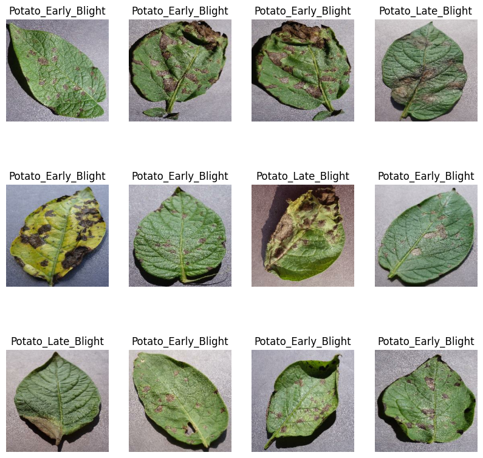
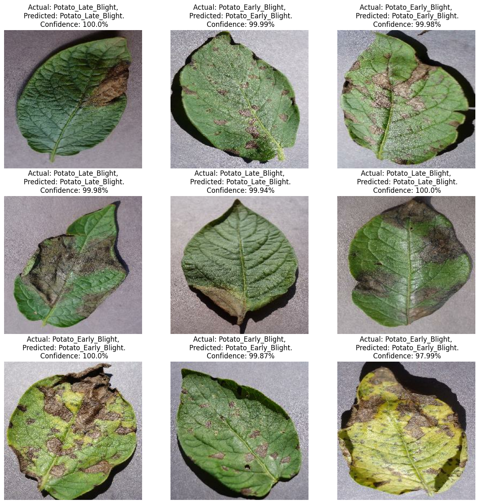

**Potato Disease Classification**

**Aim**: To develop a model to classify potato leaf images into three categories: "Early Blight," "Late Blight," and "No Disease." 
**Solution**: Implemented efficient image data preprocessing and feeding to the model using the tf.data input pipeline. Employed data augmentation, resizing, and a CNN architecture to capture spatial features, achieving 99% accuracy in potato disease classification.
**Results**: Generated outputs with actual labels, predicted labels, and confidence scores for the predictions.

Visualizing some Images of Leaves.

After splitting the dataset into training, validation, and test sets, I performed various preprocessing steps to prepare the data for training the CNN model. These steps included caching the data, shuffling the samples, and prefetching the data to optimize the training process.

To further enhance the dataset, I applied data augmentation techniques. Data augmentation helps to increase the diversity of the training samples by applying random transformations such as rotation, translation, flipping, and scaling. This augmentation process helps the model generalize better and reduces overfitting. Resized the images in the dataset to a consistent size suitable for the CNN model. Resizing the images ensures that all inputs have the same dimensions, which is a requirement for feeding the data into the CNN architecture. Later, I applied a normalization technique. Normalization helps to bring the pixel values of the images to a similar scale, preventing certain features from dominating the training process.

After preparing the dataset, I trained a CNN model on the augmented and normalized data. The CNN model is well-suited for image classification tasks as it can effectively capture spatial features using convolutional layers and learn hierarchical representations of the data.

During the training process, the CNN model achieved an impressive accuracy of 99% on the validation set, indicating that it learned to classify the images with great precision.

Training vs Validation:

Predicted the outputs with respect to confidence scores.
Predictions:

